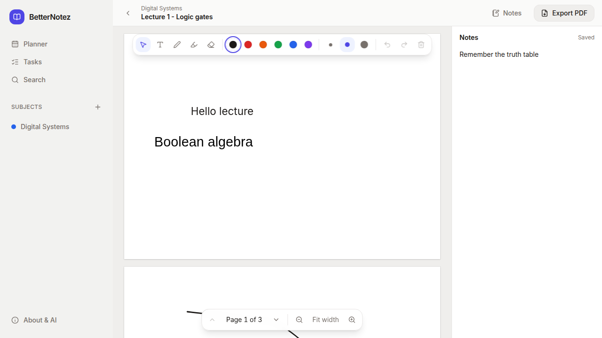
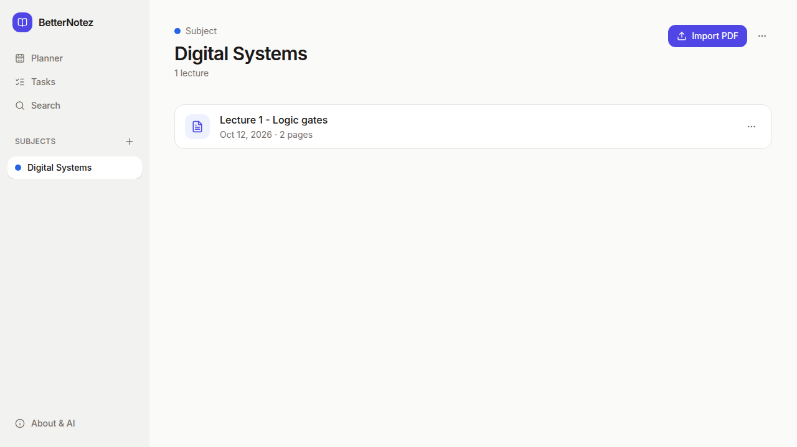
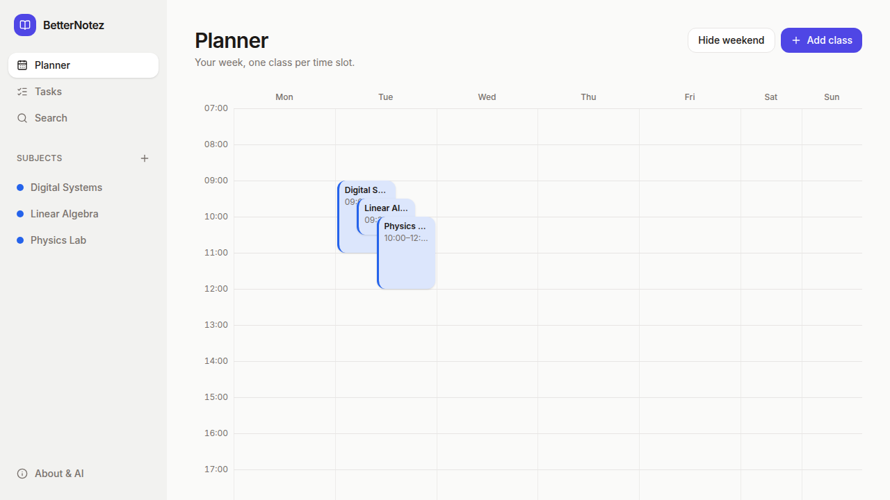
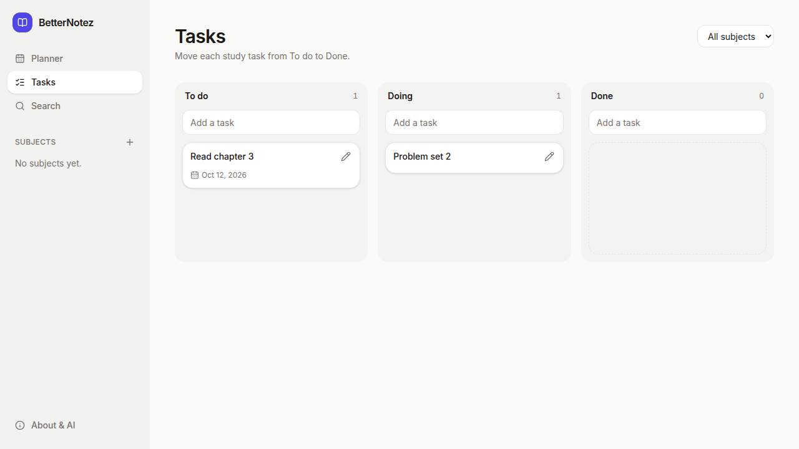
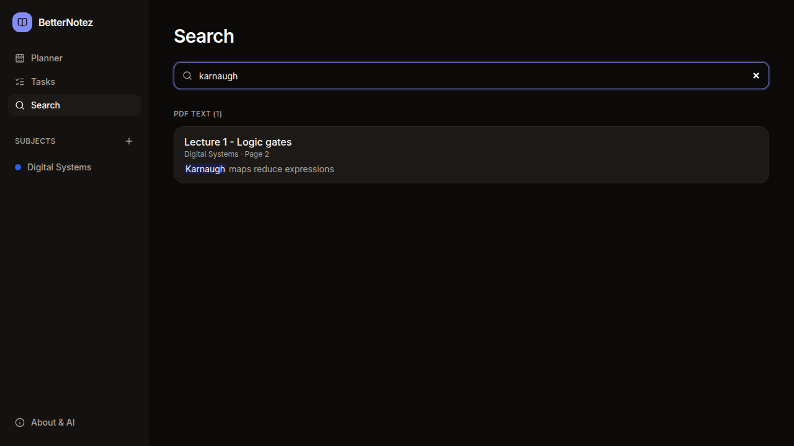

# BetterNotez

BetterNotez is a free, open-source study app for lecture PDFs. Put each subject's lectures in one place, write and draw on the pages, keep a notepad for every lecture, plan your week, and track study tasks.

It is local-first. There is no account, and your library is a folder of plain files on your own computer. An AI assistant that supports MCP, such as Claude, can read your material and help you study with it. The assistant can create and edit, but it cannot delete anything. Only you can delete, in the app.

- **Web app:** https://timmyy3000.github.io/BetterNotez/ (runs in your browser, keeps the library in that browser)
- **Desktop app:** installers for Windows, macOS, and Linux on the [Releases page](https://github.com/Timmyy3000/BetterNotez/releases)

## Screenshots



| Subject | Planner | Tasks |
| --- | --- | --- |
|  |  |  |



## Features

- **Subjects and lectures.** Make a subject for each class and import lecture PDFs into it. Add a date to a lecture if you want to sort by it. Lectures without a date work too.
- **Annotate pages.** Add text boxes and type into them, or draw freehand ink for diagrams with a mouse, touch, or stylus. Select text to highlight it in a colour, then click a highlight to change or remove it. Undo and redo cover your edits during a session.
- **A notepad per lecture.** Each lecture has its own notes, saved as you type.
- **Search.** Find text in subject names, lecture titles, notepads, text boxes, and the PDF text itself.
- **Export.** Save a lecture as a PDF with your annotations drawn on its pages. Any PDF viewer can open it.
- **Weekly planner.** Drag or click on the week to place a subject card in a time slot.
- **Task board.** Move tasks through To do, Doing, and Done. A task can link to a subject, a lecture, and a due date.
- **Open data.** Everything is stored as plain files you can read without the app. See [your library folder](#your-library-folder).

## Connect an AI assistant

The desktop app keeps your library in a folder called `BetterNotez Library` in your home folder. A small local server, the MCP server, reads and edits that folder for your assistant. The server is one file, and it runs with [Node.js](https://nodejs.org/) 22 or newer.

1. Install [Node.js](https://nodejs.org/) 22 or newer.
2. Download `betternotez-mcp.mjs` from the [latest release](https://github.com/Timmyy3000/BetterNotez/releases/latest) into a folder you will keep.
3. Connect your assistant to that file, replacing `/absolute/path/to/betternotez-mcp.mjs` with its full path.

**Claude Desktop.** Add this to `claude_desktop_config.json`, then restart Claude Desktop:

```json
{
  "mcpServers": {
    "betternotez": {
      "command": "node",
      "args": ["/absolute/path/to/betternotez-mcp.mjs"]
    }
  }
}
```

**Claude Code.** Run this once in a terminal:

```sh
claude mcp add betternotez -- node /absolute/path/to/betternotez-mcp.mjs
```

The server reads `BetterNotez Library` in your home folder, the same folder the app uses. To use another folder, add `"--library", "/path/to/folder"` to the arguments. The desktop app's **Settings** page shows both snippets with your library path already filled in, and a copy button for each.

### Running the server from source

Contributors can run the server from a checkout instead. Clone this repository, run `npm install` and `npm run build`, then use `packages/mcp/dist/index.js` in place of the file above. See [packages/mcp](packages/mcp/README.md).

Then ask your assistant, for example: "What material do I have in BetterNotez this week?" The assistant can find your material, read its PDF text, notepad, and annotations, and add or edit notes, text boxes, ink, highlights of exact text, tasks, and planner cards. Changes appear in the app right away.

The web app cannot connect an assistant, because the MCP server reads the folder on your computer.

## Your library folder

Your library is a plain folder. You can open it, copy it, or back it up without BetterNotez.

```text
BetterNotez Library/
  library.json                      format version
  planner.json                      weekly timetable cards
  tasks.json                        task board
  subjects/<subject-id>/
    subject.json                    name and color
    lectures/<lecture-id>/
      lecture.json                  title, date, page count
      lecture.pdf                   the PDF you imported
      annotations.json              text boxes and ink
      notes.md                      the lecture notepad
      text.json                     PDF text, cached for search
```

The desktop app watches this folder, so edits made by an assistant or by another program show up without a restart.

## Development

You need Node.js 22 or newer.

```sh
npm install
npm run dev            # web app at http://localhost:5173
npm run typecheck
npm test               # unit tests for core, the MCP server, and the app
npm run build
npm run test:e2e       # builds the web app, then runs the Playwright journeys
```

If port 4173 is busy, set another one for the end-to-end run, for example `E2E_PORT=4195 npm run test:e2e -w @betternotez/app`.

The desktop app is a [Tauri 2](https://v2.tauri.app/) shell around the web app, in `apps/app/src-tauri`. To run it, install the [Tauri prerequisites](https://v2.tauri.app/start/prerequisites/) for your system, then:

```sh
npm run tauri dev      # desktop app with hot reload
npm run tauri build    # installers for your system
npm run icon           # regenerate the app icons from src-tauri/app-icon.svg
```

The repository has three workspaces:

- `packages/core`: the data model, storage interface, and library operations (`@betternotez/core`).
- `packages/mcp`: the local MCP server for AI assistants (`@betternotez/mcp`).
- `apps/app`: the web and desktop app (`@betternotez/app`).

To release, push a tag such as `v0.2.0`. The release workflow builds installers for macOS (Apple silicon and Intel), Windows, and Linux, and attaches them to a draft GitHub Release. It also attaches the single-file MCP server, `betternotez-mcp.mjs`. The web app is deployed to GitHub Pages from `main`.

See [CONTRIBUTING.md](CONTRIBUTING.md) before you open a pull request.

## License

BetterNotez is free software licensed under the [GNU Affero General Public License v3.0 only](LICENSE) (AGPL-3.0-only). If you run a modified version as a service, you must make your changes available under the same license.
